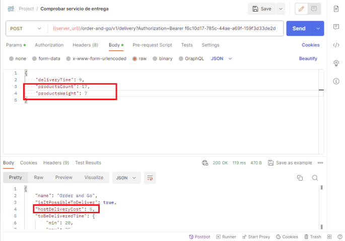
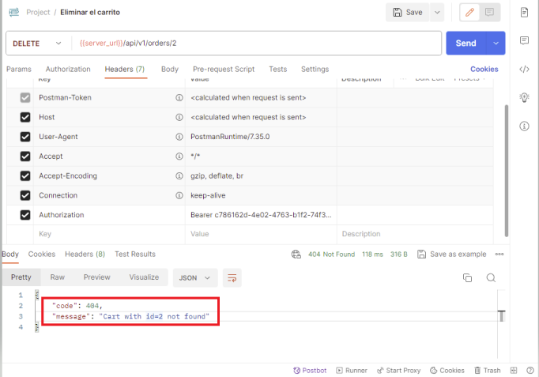

# Urban.Grocers by Postman

En este proyecto se prueba la funcionalidad de la API de Urban Grocers con una colección completa de pruebas Postman. Se validan las operaciones relacionadas con kits, entregas y el carrito de compras.

### Características:

**Análisis de requisitos:** Se realiza un análisis exhaustivo de los requisitos para cada endpoint de la API.

**Pruebas positivas y negativas:** Se diseñan pruebas para verificar el comportamiento esperado de la API en diferentes escenarios, tanto positivos como negativos.

**Reporte de bugs:** Se documentan y reportan de forma clara los errores encontrados durante las pruebas.

## Pasos para ejecutar las pruebas

1. Instalación de Postman: [The Collaboration Platform for API Development](https://www.postman.com/)
2. Importar la colección Postman desde el archivo 'Urban.Grocers.postman.collection.json'
3. Configurar el entorno de pruebas.
4. Ejecutar las pruebas.

## Entorno de pruebas
* La URL se obtiene a traves del servidor de Tripleten: containerhub.tripleten-services.com
* Documentación a traves de containerhub.tripleten-services.com/docs/

## Precondiciones
1. Crear una cuenta de usuario -> POST /api/v1/users
2. Crear un carrito -> POST /api/v1/orders
3. Crear un kit -> POST /api/v1/kits
   
## Enpoints
1. PUT /api/v1/orders/:id -> Agregar comestibles al carrito 
2. POST /order-and-go/v1/delivery -> Comprobar disponibilidad del servicio de entrega Order and Go y su costo
3. POST /api/v1/kits/{id}/products -> Agregar comestibles a un kit 
4. DELETE /api/v1/orders/:id -> Eliminar el carrito

## Resultados de las pruebas

### Resumen:

Las pruebas de los endpoints GET y PUT /api/v1/orders/:id y POST /api/v1/kits/{id}/products se completaron con éxito.
Se encontraron errores en los endpoints POST /order-and-go/v1/delivery y DELETE /api/v1/orders/:id.

## Detalles:

### Endpoints con éxito:

* GET /api/v1/orders/:id: La consulta de información de pedidos por ID funcionó correctamente, devolviendo los datos esperados en el formato especificado.
* PUT /api/v1/orders/:id: La actualización de información de pedidos por ID funcionó correctamente, actualizando los datos de forma precisa.
* POST /api/v1/kits/{id}/products: La creación de productos dentro de un kit funcionó correctamente, agregando el producto al kit con los datos esperados.

### Endpoints con errores:

* POST /order-and-go/v1/delivery: Se ha detectado que 12 casos de prueba para el endpoint POST /order-and-go/v1/delivery están fallando debido a que los resultados obtenidos no coinciden con los esperados. Tras analizar los fallos, se ha encontrado un error en la lógica de la API para este endpoint, específicamente en las pruebas relacionadas con el cálculo del costo de envío (DeliveryCost) en función del peso de los productos (productsWeight). (Se incluye evidencia de un caso ejemplo).

### Tabla de decisión DeliveryCost:
|Nro| 0-9 art| 10-15 art| >15 art | 0-3kg    | 3,1-6kg  | >6kg     | Resultado Esperado|
|--|---------|----------|---------|----------|----------|----------|----------|
| 1| si      | no       | no      | si       | no       | no       | 0$       |
| 2| si      | no       | no      | no       | si       | no       | 5$       |
| 3| si      | no       | no      | no       | no       | si       | 9$       |
| 4| no      | si       | no      | si       | no       | no       | 5$       |
| 5| no      | si       | no      | no       | si       | no       | 5$       |
| 6| no      | si       | no      | no       | no       | si       | 9$       |
| 7| no      | no       | si      | si       | no       | no       | 9$       |
| 8| no      | no       | si      | no       | si       | no       | 9$       |
| 9| no      | no       | si      | no       | no       | si       | 9$       |

* DELETE /api/v1/orders/:id: La eliminación de pedidos por ID falló. No se ejecuta la eliminación del pedido.

## Conclusiones:

La API de Urban.Grocers presenta errores en algunos endpoints, lo que afecta la funcionalidad y eficiencia de la aplicación.
Se requiere corregir los errores encontrados para que la API cumpla con los requisitos especificados en la documentación.
Recomendaciones:

Revisar la documentación de la API para comprender los requisitos específicos de cada endpoint.
Depurar los endpoints con errores para identificar la causa de los fallos y corregirlos.
Implementar pruebas automatizadas para garantizar la calidad de la API a largo plazo.
Documentar los errores encontrados y las correcciones realizadas.

### Próximos pasos:

* Se recomienda priorizar la corrección de los errores en los endpoints POST /order-and-go/v1/delivery y DELETE /api/v1/orders/:id.
* Se debe realizar un nuevo ciclo de pruebas para verificar que los errores hayan sido corregidos.
* Se debe actualizar la documentación de la API para reflejar los cambios realizados.

## Dependencias

* Postman v7.x

